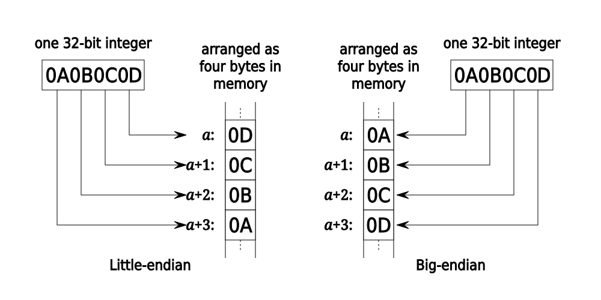
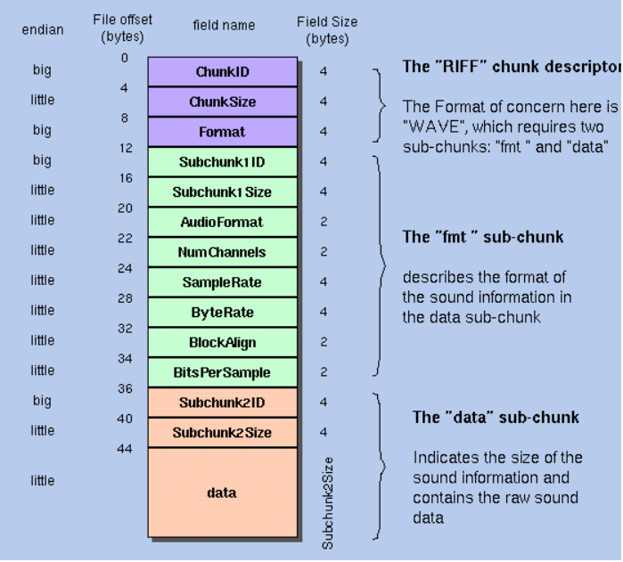

# Wav Decoder

## How is sound played on linux?

- analog sounds are vibrations of air particles forming waves
- **Analog-to-digital converter**(ADC) converts analog sound to digital ones and zeroes by taking samples of sounds at regular intervals.
- The usual simple mechanism is to fill buffers with streams of sound
- Then let the hardware read the samples, passing them to the DAC (digital to analog converter), to then reach the speaker, and vice versa
- Once the hardware has read enough samples it’ll do an interrupt to notify the software side that it needs more samples
- If the buffer samples aren’t filled fast enough we call this an underrun or drop-out (aka xruns)

`latency = buffer_size / sample_rate`

- software should choose to not follow the sound card interrupts but to rely on the operating system scheduler instead

## WAV (Waveform Audio File Format)

- audio file format to store bit stream[^1]
- uncompressed audio
- The usual bitstream encoding is the linear pulse-code modulation (LPCM) format.
- Data is store in little-endian[^2] byte order
    - little-endian stores the lest significant byte (LSB) first
    - big-endian stores the most signoficant byte (MSB) first

### Decoding Wav File

**Data Validation**:

- check for "RIFF"
- check for "WAVE"
- check file size
- validate number of channels
- check fmt chunk

- wav file header is always *44 bytes* long

### PCM Audio Stream

Pulse-code modulation (PCM) is a method used to digitally represent analog signals. It is the standard form of digital audio in computers, compact discs, digital telephony and other digital audio applications.

[^1] A bit stream is a sequence of bits.
[^2] endianness is the order in which bytes within a word of digital data are transmitted over a data communication medium or addressed (by rising addresses) in computer memory, counting only byte significance compared to earliness.

## Reference List
http://soundfile.sapp.org/doc/WaveFormat/
https://en.wikipedia.org/wiki/WAV
https://github.com/chdh/wav-file-decoder/tree/main
https://docs.fileformat.com/audio/wav/
